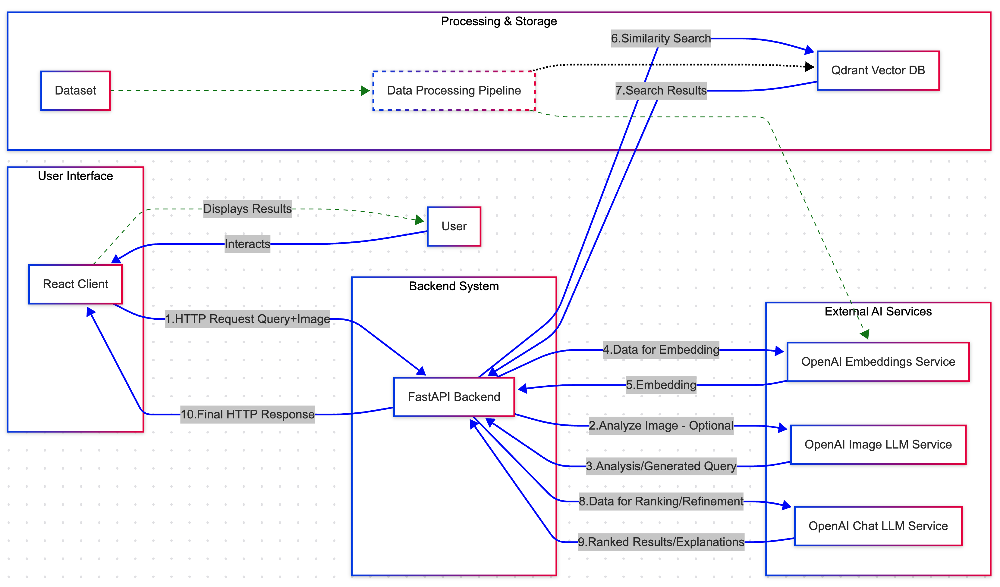
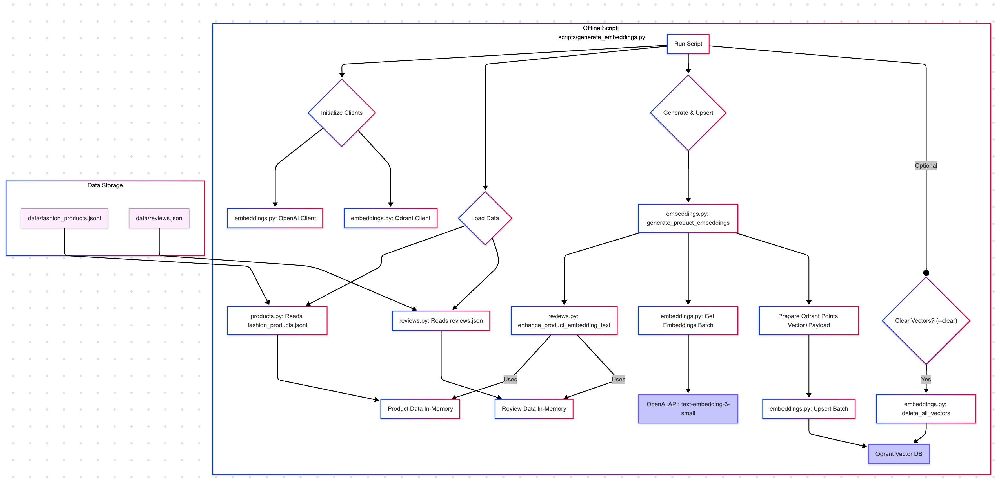
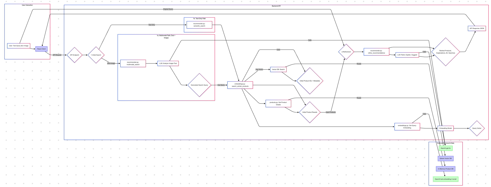

# Fashion Recommender

A multimodal semantic fashion recommendation system that uses natural language processing and optional image input to find and recommend fashion products. This system leverages OpenAI's GPT-4o and `text-embedding-3-small` model, along with Qdrant for efficient vector storage, to provide accurate semantic search. Recommendations are enhanced using insights derived from customer review data.

**Live Client Demo:** [https://product-recommender-client.onrender.com/](https://product-recommender-client.onrender.com/)


## Architecture Diagrams

Here are the architecture diagrams for the Fashion Recommender system:





## Features

- Natural language search for fashion products
- Multimodal search combining text queries with images
- Semantic matching using OpenAI embeddings (`text-embedding-3-small`)
- Qdrant vector database for scalable and efficient similarity search
- GPT-4o powered recommendation refinement and multimodal query interpretation
- Review-enhanced product embeddings incorporating key phrases, usage contexts, and sentiment
- FastAPI backend with asynchronous support
- React frontend with intuitive UI

## Project Structure

```
fashion-recommender/
├── app/                    # FastAPI backend application
│   ├── __init__.py         # Python package initialization
│   ├── main.py             # FastAPI application entry point
│   ├── products.py         # Product data management
│   ├── embeddings.py       # Embedding generation and vector storage
│   ├── recommender.py      # Recommendation logic
│   └── reviews.py          # Review processing and enhancement
├── client/                 # React frontend
│   ├── public/             # Static files
│   └── src/                # React source code
├── data/                   # Data processing and storage
│   ├── process_data.py     # Data preprocessing script
│   └── fashion_products.json       # Processed product data
├── .env                    # Environment variables (create from .env.example)
├── .env.example            # Environment variables template
├── requirements.txt        # Python dependencies
├── run.py                  # Server startup script
├── reset_vectors.py        # Utility to reset vector store
└── start.sh                # Bash script to start the server
```

## Setup and Installation

### Prerequisites

- Python 3.8+
- Node.js 14+
- OpenAI API key
- Qdrant instance (local Docker container or cloud service)
- Amazon Fashion product data (.jsonl format), example here: https://huggingface.co/datasets/McAuley-Lab/Amazon-Reviews-2023 - *for `data/process_data.py`*
- Amazon Fashion review data (.jsonl format), example here: https://huggingface.co/datasets/McAuley-Lab/Amazon-Reviews-2023 - *for `data/process_reviews.py`*

### Environment Setup

1. Clone the repository
2. Create a `.env` file based on `.env.example`:

```dotenv
OPENAI_API_KEY=your_openai_api_key_here
SERVER_PORT=8000
SERVER_HOST=0.0.0.0

# Qdrant Configuration
QDRANT_URL=http://localhost:6333  # Or your Qdrant instance URL
QDRANT_API_KEY=your_qdrant_api_key_if_any # Optional: API key for Qdrant Cloud or secured instances
QDRANT_COLLECTION_NAME=fashion_products # Or your desired collection name
```

### Docker Setup

To build and run the application using Docker, follow these steps:

1. **Build the Docker Image**:
   Navigate to the root of your project directory (where the `Dockerfile` is located) and run:
   ```bash
   docker build -t fashion-recommender .
   ```

2. **Run the Docker Container**:
   After the image is built, run the container with the following command:
   ```bash
   docker run -p 8000:8000 -e SERVE_STATIC_FILES=true --env-file .env fashion-recommender
   ```
   This command maps port 8000 of the container to port 8000 on your host machine and uses the `.env` file for environment variables.

3. **Access the Application**:
   Open your browser and go to `http://localhost:8000/` to access the Fashion Recommender API and the React frontend.

### Note
Make sure you have Docker installed and running on your machine. If you encounter any issues, refer to the Docker documentation for troubleshooting.


4. **Prepare Data:** (Run these if you have the raw Amazon datasets)
   * Process product data:
     ```bash
     python data/process_data.py --input path/to/your/product_data.jsonl --output data/fashion_products.json
     ```
   * Process review data:
     ```bash
     python data/process_reviews.py --input path/to/your/review_data.jsonl --output data/reviews.json
     ```
     *(Ensure `reviews.json` contains reviews relevant to the products in `fashion_products.json`)*

5. **Start Qdrant:** Ensure your Qdrant instance is running and accessible at the `QDRANT_URL`. For local development, you can use Docker:
```bash
docker run -p 6333:6333 qdrant/qdrant
```

6. **Generate Embeddings:** After the server starts, populate the Qdrant collection:
```bash
curl -X POST http://localhost:8000/embeddings/generate
```
*(This can take time depending on the number of products)*

The application should now be available at `http://localhost:3000`.

## Sample Usage

Interact with the frontend at `http://localhost:3000` or use the API directly.

### Text Queries

- "A comfortable summer dress for a beach vacation"
- "Professional looking men's shoes for a job interview"
- "Waterproof jacket for hiking in rainy weather"

The system performs a semantic search in Qdrant using embeddings generated by `text-embedding-3-small`. The results are then potentially refined and ranked by GPT-4o, which also provides explanations.

### Multimodal Queries (via Frontend or API)

1. Enter a text query, e.g., "find pants that match this style".
2. Upload an image of a shirt.
3. The system sends the text and image to GPT-4o, which generates a refined query (e.g., "khaki chino pants casual").
4. This refined query is used for semantic search in Qdrant.
5. Results are returned, potentially with further GPT-4o ranking/explanation.

**Example API Call (Multimodal):**
```bash
curl -X POST http://localhost:8000/recommend-multimodal \\
     -F "query_text=accessories for this dress" \\
     -F "image_file=@/path/to/your/dress_image.jpg" \\
     -F "limit=3"
```

**Example Response Snippet:**
```json
{
  "products": [
    {
      "id": "b9f5c8a2-...", // Internal Qdrant ID
      "title": "Elegant Gold Clasp Necklace",
      "price": 45.99,
      // ... other product fields ...
      "explanation": "This necklace complements the style of the dress mentioned and matches the likely formality.",
      "rating": 4.6
    },
    // ... more products ...
  ],
  "alternative_searches": [
    "gold clutch bag",
    "nude heels formal"
  ]
}
```

## Key Design Decisions and Trade-offs

* **Backend Framework:** **FastAPI** was chosen over Flask primarily for its native `asyncio` support, which is beneficial for I/O-bound operations like interacting with external APIs (OpenAI, Qdrant) and potentially databases. Its automatic data validation via Pydantic models also helps maintain API robustness.
* **Vector Database:** **Qdrant** was selected due to its open-source nature, performance, and flexibility (cloud or self-hosted).
  * *Trade-off vs. OpenAI Vector Store:* OpenAI's offering seemed more file-centric at the time of evaluation.
  * *Trade-off vs. Pinecone:* Pinecone often handles embedding generation, potentially leading to vendor lock-in and higher costs. Qdrant provides more control over the embedding process and infrastructure.
* **LLM:** **GPT-4o** serves two main roles:
  1. *Multimodal Query Interpretation:* Analyzing text and images together to generate more contextually relevant search queries for the vector database.
  2. *Recommendation Refinement:* Reranking initial semantic search results based on the user's specific query nuances and providing natural language explanations for recommendations. Its cost and strong reasoning capabilities are key here.
* **Embedding Model:** **`text-embedding-3-small`** was chosen as a balance between performance, cost, and speed. It provides strong semantic understanding for product text and review data at a lower cost and latency compared to larger models.
* **Review Enhancement:** Product text used for generating embeddings is enriched with key phrases, common usage contexts, and sentiment extracted from customer reviews. This aims to capture nuances not present in standard product descriptions, improving search relevance.
* **Data Storage:** Currently, product metadata is loaded into memory from a JSON file (`data/fashion_products.json`) on startup.
  * *Trade-off:* Simple and fast for smaller datasets, but does not scale well. A persistent database (like PostgreSQL or MongoDB) would be necessary for larger product catalogs.

## Future Improvements

* **Multiple Item Search:** Allow users to search for combinations of items (e.g., "find a shirt and pants for a summer party").
* **Conversational Interaction:** Implement state management to allow users to refine previous search results or build upon recommendations conversationally (potentially using OpenAI's Responses API).
* **Database Integration:** Replace the in-memory product store with a scalable database solution for better performance and scalability.

## Reset Vector Store

To clear all vectors from your Qdrant collection (useful for re-indexing):

```bash
python reset_vectors.py
# Or use the API endpoint:
# curl -X POST http://localhost:8000/embeddings/delete
```

## API Endpoints

* `GET /`: API status check.
* `GET /products`: Get a list of products (from memory).
* `GET /products/{product_id}`: Get a specific product (from memory).
* `GET /reviews/{product_id}`: Get processed review summary for a product.
* `POST /embeddings/generate`: Trigger background task to generate/upsert embeddings to Qdrant.
* `POST /embeddings/delete`: Trigger background task to delete all vectors from the Qdrant collection.
* `GET /search?query=...&limit=...`: Perform text-based semantic search.
* `GET /recommend?query=...&limit=...`: Perform text-based semantic search followed by LLM refinement.
* `POST /multimodal-search`: Perform multimodal (text + image) search.
* `POST /recommend-multimodal`: Perform multimodal search followed by LLM refinement.

## Technology Stack

- **Backend**: FastAPI, Python, OpenAI API (GPT-4o, Embeddings)
- **Vector Database**: Qdrant
- **Frontend**: React, JavaScript, CSS
